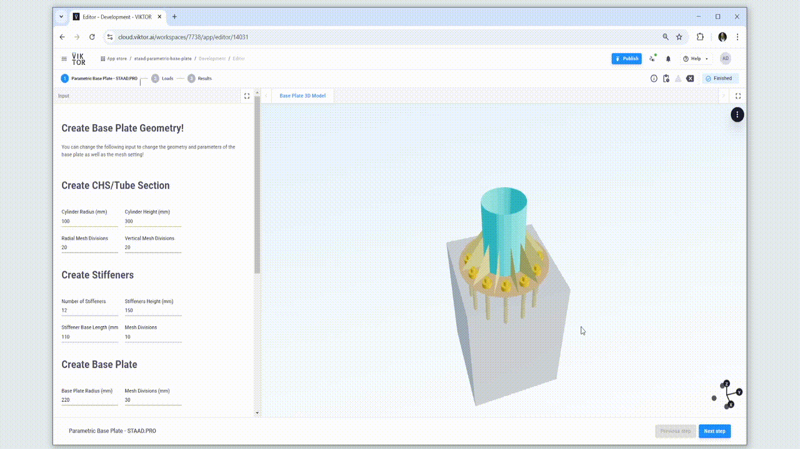
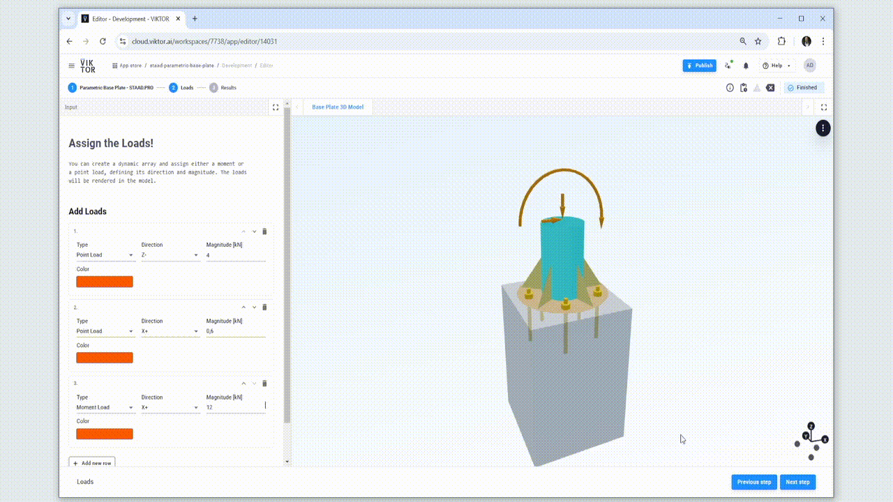
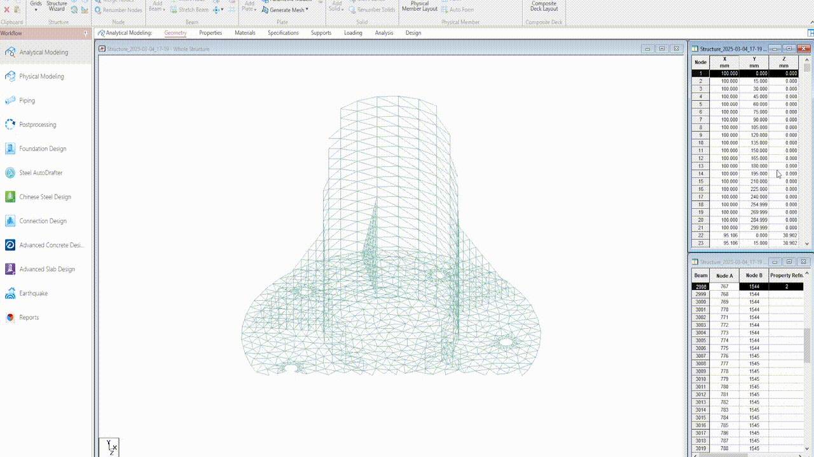
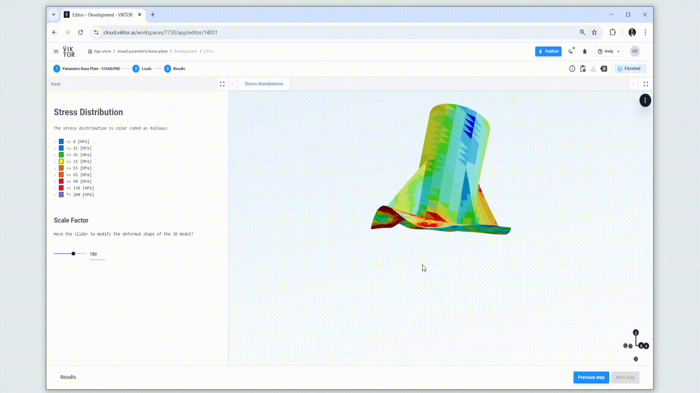

# STAAD.Pro Parametric Base Plate Connection
This template app demonstrates how to perform a structural analysis of a 3D baseplate connection and display the results using Viktor. The structural analysis is conducted with STAAD.PRO, a powerful and widely-used software for analyzing the structural response of structural systems. By combining Viktor with STAAD.PRO, structural analysis becomes easy to perform and accessible through a web browser.

Features include:

- Creation and visualization of the 3D baseplate model,
- Creation and visualization of the model mesh.
- Definition of loads,
- Running the structural analysis in STAAD.PRO
- Visualization of the stress distribution and deformation

Note:
Please note that this is a demo app. It is not intended for use out of the box for real-world design. The main purpose is to showcase the capabilities of OpenSTAAD along with VIKTOR.

## Step 1a - Geometry Definition
The following parameters can be defined and modified:
- CHS height
- CHS diameter
- CHS mesh setting
- Number of stiffeners
- Width and height of stiffeners
- Stiffener mesh settings 
- Bottom plate diameter 
- Number of bolt holes
- Hole diameters
- Edge to hole distance 
- Shell thickness

## Step 1b - Geometry Definition
You can toggle a vkt.Boolean field to display the generated mesh as shown below:

## Step 2 - Load Definitions 
The following load types can be defined and applied at the top of the CHS:
- Bending loads
- Axial loads
- Shear loads

For each of the loads, the user can define:
- Load direction 
- Load magnitude
- Load arrow color 

## Step 3a - Running the Model 
A STAAD.PRO model is created using the OPENSTAAD Python API. The inputs defined in the app are sent to the user's server/local machine when the model is constructed and executed using the VIKTOR worker (refer to reference section).

## Step 3b - Results 
The results are sent back to the web application and the user will see the deformed shape and the max. von Mises stress distribution. Also, the user can increase the deformation factor to better visualize the deformed shape of the base plate.

## Reference 
The connection between the app and STAAD.PRO is made with a [Worker](https://docs.viktor.ai/docs/create-apps/software-integrations/staadpro/), an executable that connects a server and a computer with STAAD.PRO to the web app. You can refer to the following tutorial to learn how to set up the connection:  
[STAAD.PRO Integration Tutorial](https://docs.viktor.ai/docs/tutorials/integrate-staadpro/)
